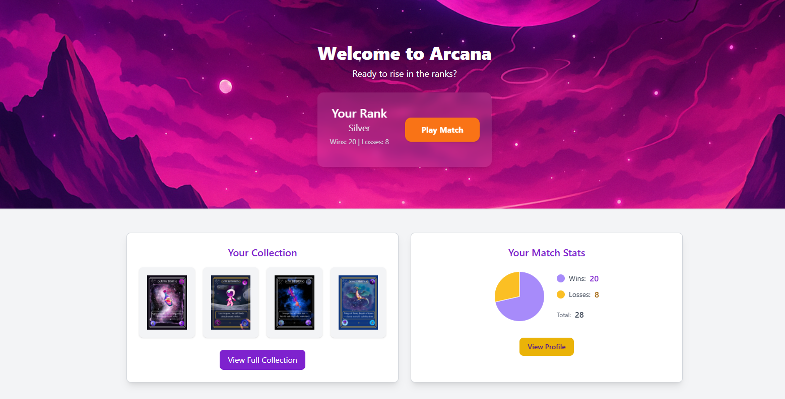
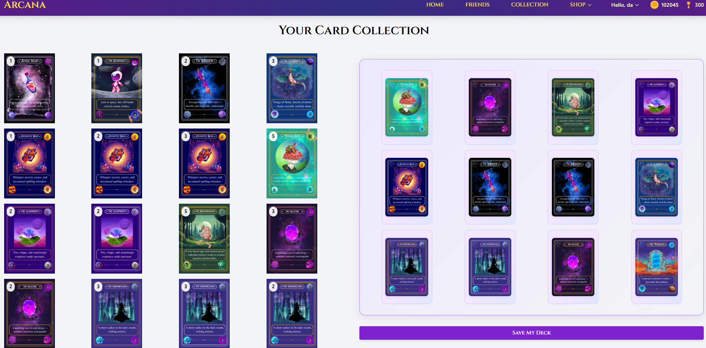
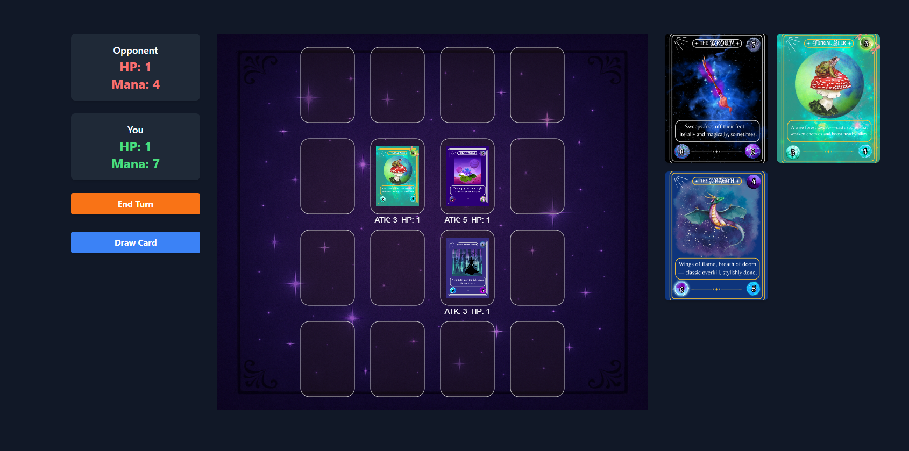
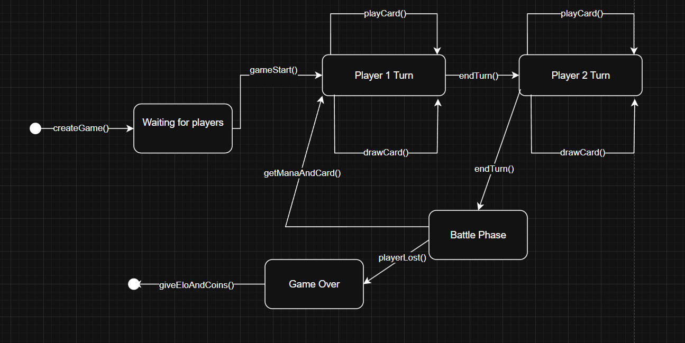
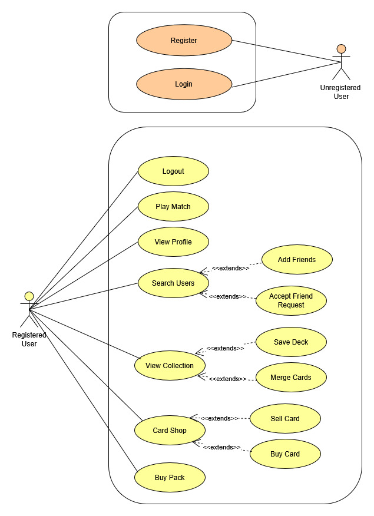
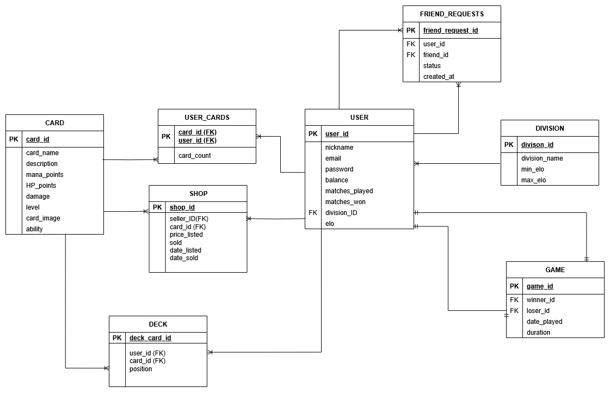
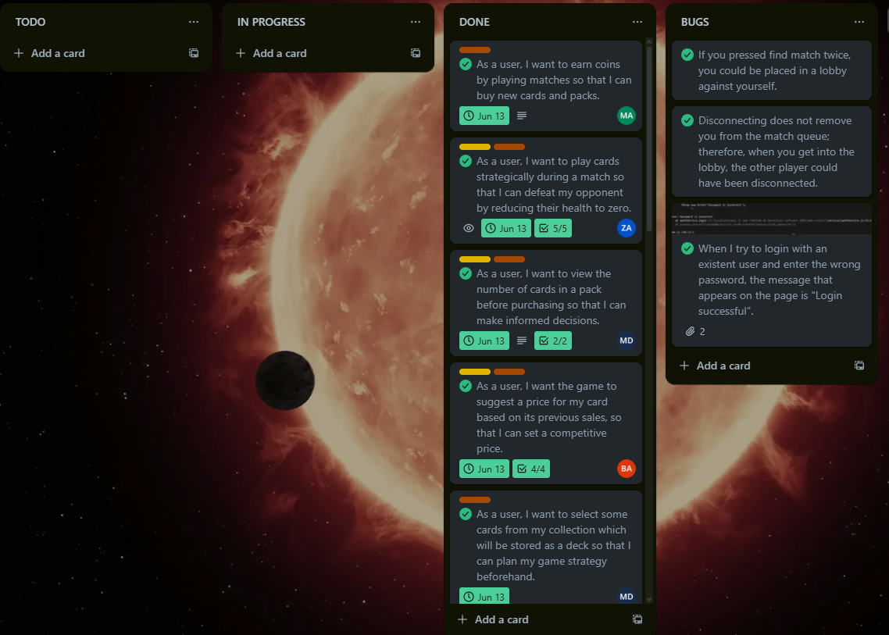
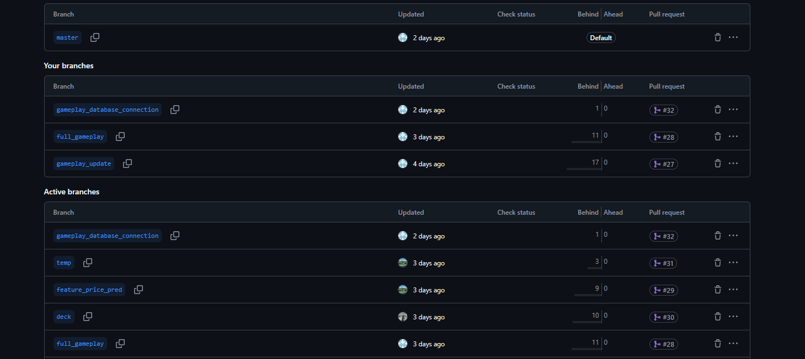
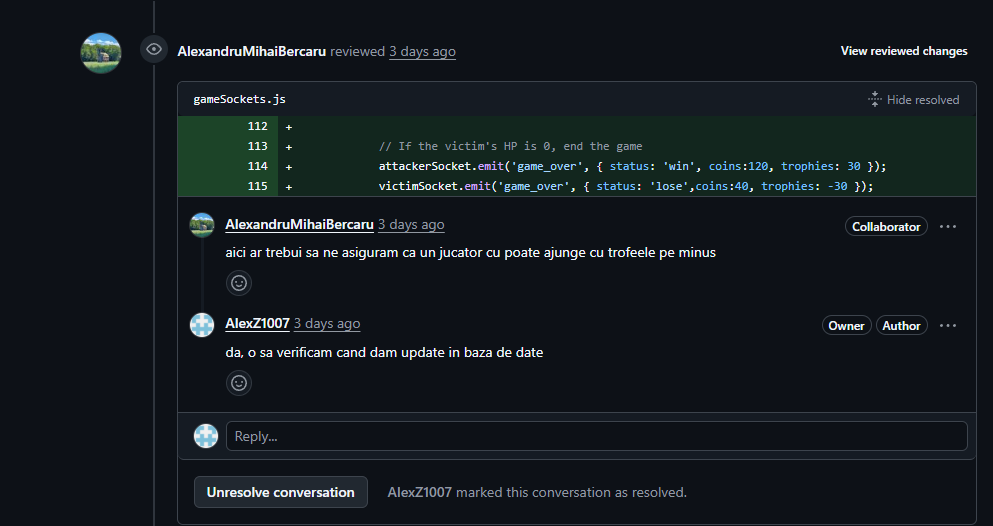
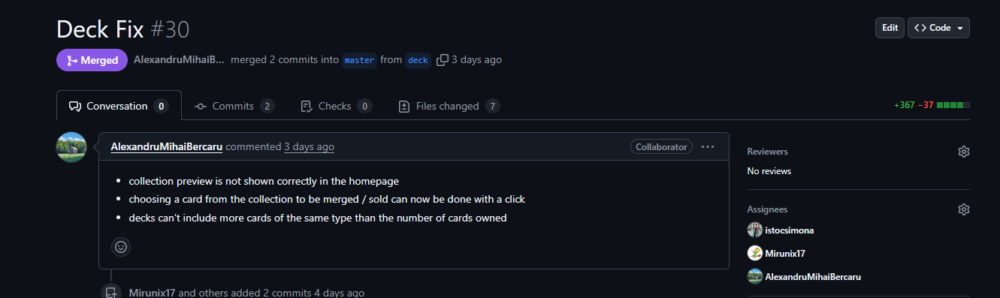

# ARCANA - Official Page

## Let the magic begin
Welcome to the world of **ARCANA**!
- Complete your collection!
- Make friends!
- Earn trophies!

## General Presentation

### [Demo on youtube](https://www.youtube.com/watch?v=gWz60hM_llE)

Home Page

Collection Page

Battle Arena

## DEVELOPMENT

### UML Diagrams

Gameplay state diagram

Use case diagram

### Databsase diagram

Database Diagram

### Team Work

Trello Board

Git Branches

Code Review

Bug Fixes

### Design patterns
## Design Patterns

- In `./server/database.js`, we used the **Singleton** pattern for the database connection.
- In `./services/shopObserver.js`, we used the **Observer** pattern to update the model that makes price predictions when new cards are listed.

## Local set-up

### Python Environment Setup

To set up the Python environment and install all dependencies, follow these steps:

1. **Create a virtual environment** (if you don't already have one):

   ``python -m venv services/ml/project_env``

2. **Activate the virtual environment**
    ``services\ml\project_env\Scripts\activate``

3. **Install dependencies**
    ``pip install -r services/ml/requirements.txt``

### NPM Setup

1. **Install node packages**
   ``npm install``

2. **Configure the .env file**

3. **Start the server** ``npm start``  

Now you're good to go!

